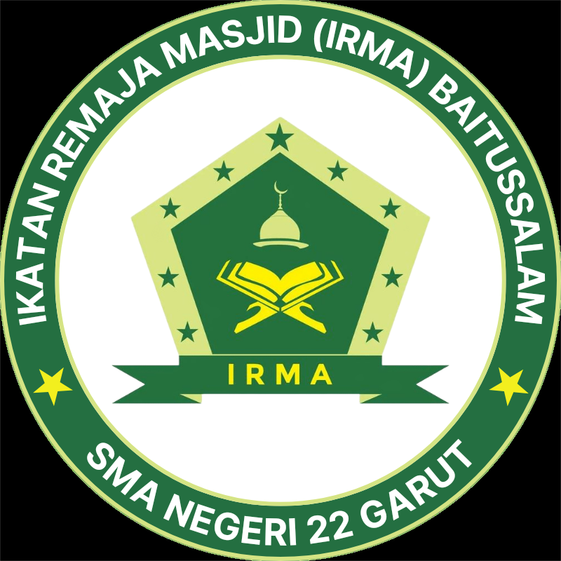

<h3>IRMA Baitussalam</h3>
<h3><a href="https://irmabaitussalam.github.io"></h3></a>

[Facebook](https://facebook.com/people/IRMA-SMAN-22-GARUT/100083337945272) | [Instagram](https://www.instagram.com/irmasman22garut_official) | [WhatsApp](https://wa.me/6283173511053) | [Twitter](https://www.twitter.com/irmasman22garut) | [TikTok](https://www.tiktok.com/@irmasman22garut_official) | [YouTube](https://www.youtube.com/@IRMABaitussalam) | [Email](mailto:irmabaitussalam22garut@gmail.com) | [Website](https://irmabaitussalam.github.io) | [Lisensi](LICENSE)

# irmabaitussalam.github.io
Selamat datang 👋 di repositori resmi dari situs web IRMA Baitussalam 🥳. Repositori ini berfungsi sebagai pusat pengembangan, pemeliharaan, dan perbaikan situs web IRMA Baitussalam.

IRMA Baitussalam adalah organisasi terkemuka yang berdedikasi untuk mempromosikan pendidikan dan menciptakan lingkungan belajar yang positif. Situs web ini memperlihatkan misi, visi, dan berbagai inisiatif yang dilakukan oleh organisasi ini untuk memberdayakan individu melalui pendidikan.

Repositori ini berisi kode sumber, aset desain, dan berkas relevan lainnya yang diperlukan untuk pengembangan dan penyebaran situs web IRMA Baitussalam. Dengan memanfaatkan repositori ini, kami bertujuan untuk memastikan transparansi, kolaborasi, dan efisiensi dalam mengelola siklus pengembangan situs web.

Para kontributor 🛠️ ke repositori ini diharapkan mengikuti praktik terbaik dan mengikuti pedoman pengkodean yang telah ditetapkan untuk menjaga standar kualitas kode yang tinggi. Ini termasuk penggunaan teknologi yang tepat, mengikuti prinsip desain responsif, dan menerapkan langkah-langkah keamanan yang kuat.

# Lisensi

Situs web IRMA Baitussalam ([irmabaitussalam.github.io](https://irmabaitussalam.github.io)) berada di bawah lisensi Apache 2.0, sebuah lisensi open-source yang sangat diakui karena ketentuannya yang longgar dan fleksibel. Lisensi ini memberikan kebebasan kepada pengguna untuk menggunakan, memodifikasi, mendistribusikan, dan memberikan sublisensi terhadap kode sumber dan dokumentasi yang ada dalam repositori ini.

Dalam Lisensi Apache 2.0, para kontributor untuk repositori situs web IRMA Baitussalam tetap mempertahankan kepemilikan hak cipta mereka sambil memberikan lisensi non-eksklusif kepada orang lain. Lisensi ini memungkinkan individu dan organisasi untuk membangun, menggabungkan, dan mendistribusikan karya turunan berdasarkan kode sumber asli.

Lisensi Apache 2.0 juga memastikan bahwa pengguna menerima perangkat lunak "sebagaimana adanya", tanpa jaminan atau kondisi apa pun, baik yang diungkapkan maupun yang tersirat. Namun, lisensi ini memberikan batasan tanggung jawab, melindungi kontributor dan pengelola dari klaim hukum terkait penggunaan perangkat lunak tersebut.

Salah satu persyaratan penting dari Lisensi Apache 2.0 adalah penyertaan salinan teks lisensi dalam setiap distribusi perangkat lunak. Ini memastikan bahwa pengguna yang sadar akan hak dan tanggung jawab mereka di bawah lisensi.

Sebagai kontributor atau pengguna repositori situs web IRMA Baitussalam, penting untuk meninjau dan mematuhi ketentuan Lisensi Apache 2.0. Dengan melakukannya, kita mendorong lingkungan kolaboratif dan terbuka yang mendorong berbagi pengetahuan, mendorong inovasi, dan mendukung pertumbuhan komunitas open-source 🌐.

Untuk informasi lebih rinci tentang hak dan kewajiban yang diberikan oleh Lisensi Apache 2.0, silakan lihat berkas [LISENSI](LICENSE) di repositori tersebut 👆.

# Kontributor Statistik
### IRMA Baitussalam

### Rangga Fajar Oktariansyah

Copyright © 2023 IRMA Baitussalam
